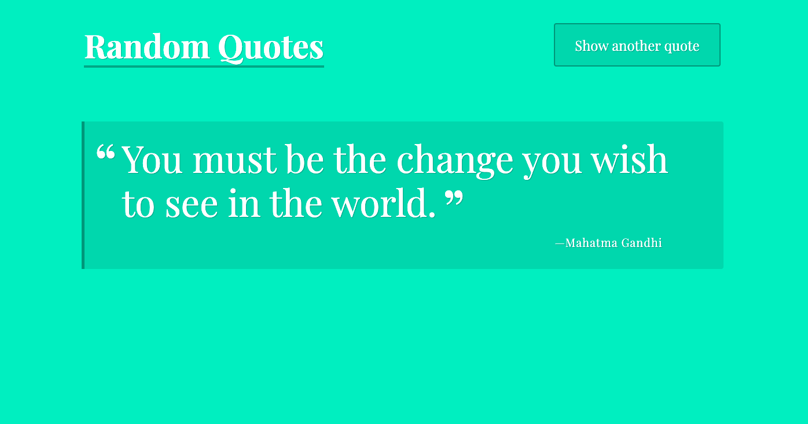
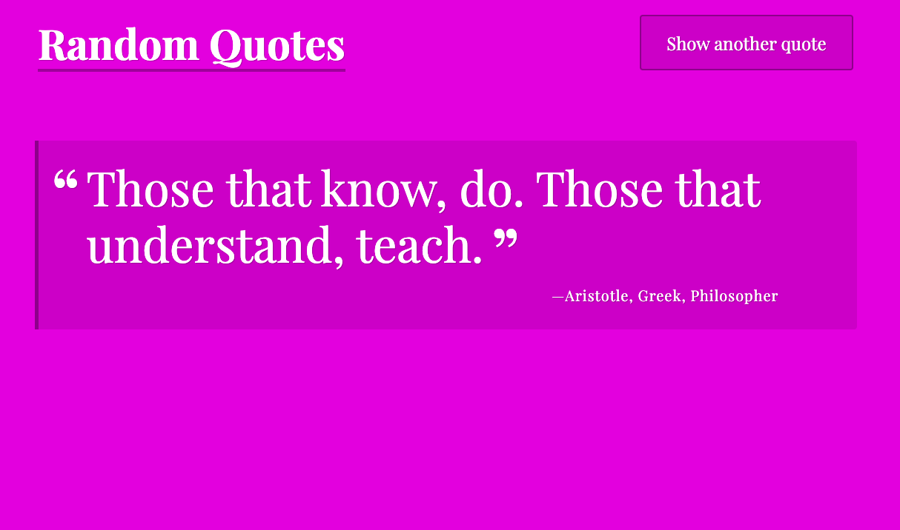

# Project_1

This project is a single page javascript application that displays random quotes.

## Examples

## Motivation

The motivation for completing Project_1 is to be graded and recieve feedback on my javascript development. I also plan on adding this project to my portfolio to use later on as I apply for jobs.

## Built with

HTML
CSS
JAVASCRIPT

## How to use?

The functionality of this application is fairly simple. Clicking on the "Show another quote" button on the top right of the page will display a different random quote or just let the quote change automatically every 10 seconds.

## Credits

The HTML & CSS of this project was created by the Treehouse Techdegree team. The javascript file is where most of my work would be found.

## License

MIT © Ahmad Ibrahim

## Table of Contents

- [Project_1](#project_1)
  - [Examples](#examples)
  - [Motivation](#motivation)
  - [Built with](#built-with)
  - [How to use?](#how-to-use)
  - [Credits](#credits)
  - [License](#license)
  - [Table of Contents](#table-of-contents)
